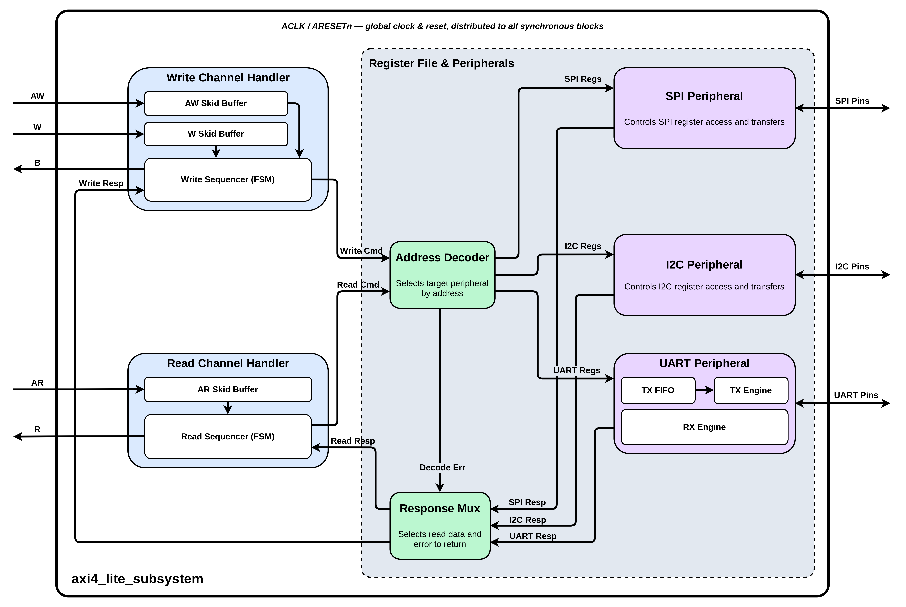

# AXI4-Lite Peripheral Subsystem Microarchitecture Specification (MAS)

This document defines the functional and microarchitectural behavior of the register-mapped AXI4-Lite Peripheral Subsystem. The subsystem acts as a bridge, exposing three serial communication controllers behind a single AXI4-Lite slave interface.

---

## 1. Interface Contract

The subsystem exposes the following logical interfaces and configurable parameters:

| Logical Interface | Description / Contract | Associated Information |
|---|---|---|
| **System Controls** | System clock and synchronous reset input. | Single clock domain; active-low reset. |
| **AXI4-Lite Slave Port** | Five-channel host port for register configuration and status access. | 32-bit data width, 12-bit address space, single-outstanding. |
| **SPI Master Interface** | Serial interface for communicating with external SPI devices. | Serial clock, master serial output, master serial input, and chip select. |
| **I2C Master Interface** | Two-wire serial interface for external I2C devices. | Host-driven clock line (no clock stretching); bidirectional open-drain data line. |
| **UART Interface** | Asynchronous serial interface for console communications. | Serial transmit and serial receive lines. |

**System Parameters:**
*   **Local Address Width**: Fixed at 12 bits (4 KB local address space). Not configurable.
*   **System Data Width**: Fixed at 32 bits. Not configurable.
*   **Transmit FIFO Depth**: Fixed at 64 entries. Not exposed as a top-level parameter.

**Top-Level Signal Contract**

| Signal | Width | Direction | Description |
|---|---|---|---|
| `ACLK` | 1 | Input | System clock. |
| `ARESETn` | 1 | Input | Active-low synchronous reset. |
| `AWADDR` | 12 | Input | Write address. |
| `AWPROT` | 3 | Input | Write protection type (accepted, unused). |
| `AWVALID` | 1 | Input | Write address valid. |
| `AWREADY` | 1 | Output | Write address ready. |
| `WDATA` | 32 | Input | Write data. |
| `WSTRB` | 4 | Input | Write byte-lane strobes. |
| `WVALID` | 1 | Input | Write data valid. |
| `WREADY` | 1 | Output | Write data ready. |
| `BRESP` | 2 | Output | Write response. |
| `BVALID` | 1 | Output | Write response valid. |
| `BREADY` | 1 | Input | Write response ready. |
| `ARADDR` | 12 | Input | Read address. |
| `ARPROT` | 3 | Input | Read protection type (accepted, unused). |
| `ARVALID` | 1 | Input | Read address valid. |
| `ARREADY` | 1 | Output | Read address ready. |
| `RDATA` | 32 | Output | Read data. |
| `RRESP` | 2 | Output | Read response. |
| `RVALID` | 1 | Output | Read data valid. |
| `RREADY` | 1 | Input | Read data ready. |
| `SPI_SCLK` | 1 | Output | SPI serial clock. |
| `SPI_MOSI` | 1 | Output | SPI master-out serial data. |
| `SPI_MISO` | 1 | Input | SPI master-in serial data. |
| `SPI_CSN` | 1 | Output | SPI chip select, active-low. |
| `I2C_SCL` | 1 | Output | I2C serial clock, push-pull, no clock stretching. |
| `I2C_SDA` | 1 | Inout | I2C serial data, open-drain. |
| `UART_TX` | 1 | Output | UART serial transmit. |
| `UART_RX` | 1 | Input | UART serial receive. |

---

## 2. Clock and Reset Semantics

*   **Single Clock Domain**: All internal buffers, controllers, and peripheral cores operate on a single system clock. No Clock Domain Crossing (CDC) logic or separate clock networks are implemented.
*   **Baud and Bit Rate Generation**: Serial baud rates and clock frequencies (such as SPI clock, I2C clock, and UART baud rates) are derived directly from the system clock using integer counters or clock enable signals.
*   **Reset State**: On active-low reset assertion, all AXI validation signals are held low, transaction handlers return to their idle states, configuration registers revert to safe default values, and the UART transmit FIFO is cleared.

---

## 3. Input Skid Buffers

To optimize timing and decouple external ready/valid handshakes, the subsystem places a 2-entry pipeline stage on the write address, write data, and read address input channels. 
*   **Operation**: Each buffer contains an output register for presenting downstream transactions and a skid register to catch incoming data if the downstream interface stalls. 
*   **Handshake**: Ready and valid control signals are registered. The input ready signal does not combinationally depend on the downstream ready signal, preventing long timing paths.

The buffer is defined by the following three-state machine:

| State | `in_ready` | `out_valid` | Transition Behavior |
|---|---|---|---|
| **EMPTY** | 1 | 0 | On an input handshake, capture the beat into the output register and move to BUSY. |
| **BUSY** | 1 | 1 | If the downstream accepts and a new input beat arrives, reload the output register and remain in BUSY. If the downstream accepts with no new input, move to EMPTY. If the downstream stalls while a new input beat arrives, capture it into the skid register and move to FULL. |
| **FULL** | 0 | 1 | Input ready is de-asserted. When the downstream accepts, transfer the skid register into the output register and return to BUSY. |

---

## 4. UART Transmit FIFO

A synchronous FIFO is instantiated on the UART transmit datapath.
*   **Properties**: Operates entirely in the system clock domain. Uses read and write pointers one bit wider than the address, with no separate occupancy counter; full and empty are registered flags, one cycle behind the pointers. Depth must be a power of two.
*   **Read Style**: Registered pop, not first-word fall-through. A single-cycle read request captures the addressed byte into the output register on the next clock edge. The output holds its value until the next accepted pop.
*   **Behavioral Rules**:
    *   **Push**: Accepted if the FIFO is not full, or if full with a concurrent pop. Writes the byte to the write pointer and advances it.
    *   **Pop**: Accepted if the FIFO is not empty, or if empty with a concurrent push. Advances the read pointer; if the FIFO was empty, the pushed byte is forwarded directly to the output instead of being read from memory.
    *   **Safety**: Overflow is prevented except during the full-plus-pop bypass, which leaves occupancy unchanged. Underflow is prevented except during the empty-plus-push bypass, which forwards the byte directly.

---

## 5. Write and Read Transaction Handlers

The subsystem coordinates host transactions using independent write and read controllers.

### 5.1 Write Handler
*   **Beat Merging**: Accepts write address and write data beats in any arrival order (address first, data first, or concurrently).
*   **Commit**: Once both address and data beats are captured, the write is committed to the register file according to the write strobe byte enables.
*   **Response**: A write response is returned indicating success, write-protection violation, or an invalid address.

The write handler is defined by the following four-state machine. Address and data beats are captured independently; both ready signals de-assert once their beat is captured, enforcing single-outstanding behavior.

| State | `AWREADY` | `WREADY` | `BVALID` | Transition Behavior |
|---|---|---|---|---|
| **W_IDLE** | 1 | 1 | 0 | If address and data arrive together, latch both and move to W_RESP. If only the address arrives, latch it and move to W_WAIT_DATA. If only the data arrives, latch it and move to W_WAIT_ADDR. |
| **W_WAIT_DATA** | 0 | 1 | 0 | Await the write data beat; on arrival, latch it and move to W_RESP. |
| **W_WAIT_ADDR** | 1 | 0 | 0 | Await the write address beat; on arrival, latch it and move to W_RESP. |
| **W_RESP** | 0 | 0 | 1 | Commit the write and evaluate the response on entry. Hold the response until it is accepted, then return to W_IDLE. |

### 5.2 Read Handler
*   **Multiplexing**: Accepts read addresses, decodes the target register, and presents the register data on the read data channel.
*   **Response**: Returns the read data and a response indicating success or an invalid address.
*   **Side-Effects**: Commits read-sensitive state changes (such as clearing status flags) only when the read transaction is successfully completed on the bus handshake.

The read handler is defined by the following two-state machine:

| State | `ARREADY` | `RVALID` | Transition Behavior |
|---|---|---|---|
| **R_IDLE** | 1 | 0 | On a read address handshake, latch the address and move to R_RESP. |
| **R_RESP** | 0 | 1 | Decode the target and evaluate read data and response on entry. Hold until the read data is accepted on the bus handshake, then apply read side-effects and return to R_IDLE. |

**Response Encoding:** `OKAY` (`2'b00`) for successful accesses; `SLVERR` (`2'b10`) for writes to read-only registers; `DECERR` (`2'b11`) for unmapped addresses. `EXOKAY` (`2'b01`) is never generated.

---

## 6. Address Page Decoding

The local address space is divided into 256-byte pages:

| Address Page | Base Offset | Target Device | Mapping Description |
|---|---|---|---|
| **Page 0** | `0x000` | SPI Master | Controls configuration, transmission, and status of the SPI master core. |
| **Page 1** | `0x100` | I2C Master | Controls slave addressing, read/write commands, transmission, and status of the I2C master. |
| **Page 2** | `0x200` | UART Console | Exposes the transmit FIFO and receive data from the serial console. |
| **Others** | — | Reserved | Unmapped memory region. Returns a decode error response on access. |

The page is selected by address bits `[11:8]` and the register by bits `[7:2]`. Bits `[1:0]` are not used for decoding; sub-word access is expressed through the write strobes.

---

## 7. Register Functionality

Each page exposes the following registers. All registers are 32 bits wide and word-aligned. Reserved bits ignore writes and read as zero. Status bits are driven by the associated core or FIFO and are not host-writable.

### 7.1 SPI Master Registers
Offsets are relative to the SPI page base (`0x000`).

| Offset | Register | Access | Reset | Bit Fields |
|---|---|---|---|---|
| `0x00` | `SPI_CTRL` | RW | `0x0` | `[0]` EN — core enable. `[1]` START — write-1 launches one transfer; self-clearing. |
| `0x04` | `SPI_STATUS` | RO | `0x0` | `[0]` BUSY — transfer in progress. `[1]` RX_VALID — set on completion; cleared on `SPI_RXDATA` read. |
| `0x08` | `SPI_TXDATA` | RW | `0x0` | `[7:0]` Transmit byte. |
| `0x0C` | `SPI_RXDATA` | RO | `0x0` | `[7:0]` Received byte. Reading clears `RX_VALID`. |
| `0x10` | `SPI_CFG` | RW | `0x0` | `[0]` CPOL. `[1]` CPHA. `[31:16]` CLK_DIV — serial clock divider. |

### 7.2 I2C Master Registers
Offsets are relative to the I2C page base (`0x100`).

| Offset | Register | Access | Reset | Bit Fields |
|---|---|---|---|---|
| `0x00` | `I2C_CTRL` | RW | `0x0` | `[0]` EN. `[1]` START — write-1 launches one transaction; self-clearing. `[2]` RW_N — 0 = write, 1 = read. |
| `0x04` | `I2C_STATUS` | RO | `0x0` | `[0]` BUSY. `[1]` RX_VALID — cleared on `I2C_RXDATA` read. `[2]` NACK — sticky acknowledge-failure flag; cleared when START is next written. |
| `0x08` | `I2C_ADDR` | RW | `0x0` | `[6:0]` 7-bit slave address. |
| `0x0C` | `I2C_TXDATA` | RW | `0x0` | `[7:0]` Transmit byte. |
| `0x10` | `I2C_RXDATA` | RO | `0x0` | `[7:0]` Received byte. Reading clears `RX_VALID`. |
| `0x14` | `I2C_CFG` | RW | `0x0` | `[15:0]` CLK_DIV — SCL divider. |

### 7.3 UART Registers
Offsets are relative to the UART page base (`0x200`).

| Offset | Register | Access | Reset | Bit Fields |
|---|---|---|---|---|
| `0x00` | `UART_CTRL` | RW | `0x0` | `[0]` TX_EN — enables the transmit FIFO to drain into the core. `[1]` RX_EN. |
| `0x04` | `UART_STATUS` | RO | `0x0` | `[0]` TX_READY — transmit FIFO not full. `[1]` TX_EMPTY — FIFO empty and core idle. `[2]` RX_VALID — cleared on `UART_RXDATA` read. `[3]` RX_OVERRUN — sticky; cleared on `UART_RXDATA` read. `[4]` RX_PERR — sticky; cleared on `UART_RXDATA` read. |
| `0x08` | `UART_TXDATA` | RW | `0x0` | `[7:0]` Transmit byte. Writing pushes into the transmit FIFO when it is not full. |
| `0x0C` | `UART_RXDATA` | RO | `0x0` | `[7:0]` Received byte. Reading clears `RX_VALID`, `RX_OVERRUN`, and `RX_PERR`. |
| `0x10` | `UART_CFG` | RW | `0x0` | `[15:0]` BAUD_DIV — baud rate divider. `[16]` PARITY_EN — 0 = disabled, 1 = enabled. `[17]` PARITY_MODE — 0 = even, 1 = odd. `[18]` STOP_BITS — 0 = one stop bit, 1 = two. |

UART frame data width is fixed at 8 bits, matching `UART_TXDATA`/`UART_RXDATA`.

---

## 8. Register and FIFO Side-Effects

*   **Self-Clearing Triggers**: Writing to start-transfer controls triggers a transaction and immediately returns to an idle state on subsequent reads.
*   **Read-to-Clear Flags**: Reading a receive data register automatically clears its corresponding data-valid status flags on the cycle the read transaction completes; UART's sticky `RX_OVERRUN` and `RX_PERR` clear the same way.
*   **Write Strobe Masking**: Register writes only update bytes where the write strobe is active. Unasserted byte lanes are ignored.
*   **Write Protection**: Attempting to write to read-only status registers leaves the registers unchanged and returns a slave error response.
*   **Transmit FIFO Backpressure**: Writing transmit data when the transmit FIFO is full results in the byte being dropped. The write transaction still returns a success response to prevent bus lockups.

---

## 9. Architectural Scope and Limits

The design scope is deliberately bounded by the following simplifications:
*   **Single-Outstanding Transactions**: The subsystem handles one transaction at a time per interface path; subsequent requests are stalled at the input buffers.
*   **Single-Byte Transfers**: Serial interfaces are restricted to single-byte transactions. Hardware-level multi-byte streaming is not supported.
*   **Status Polling**: The subsystem uses status polling exclusively. No interrupt lines are exposed.
*   **Synchronous Operation**: All control paths are synchronous. The subsystem does not implement asynchronous logic, Gray coding, or metastability filters.
*   **No I2C Clock Stretching**: `I2C_SCL` is host-driven and push-pull. Slave-side clock stretching is not supported.
