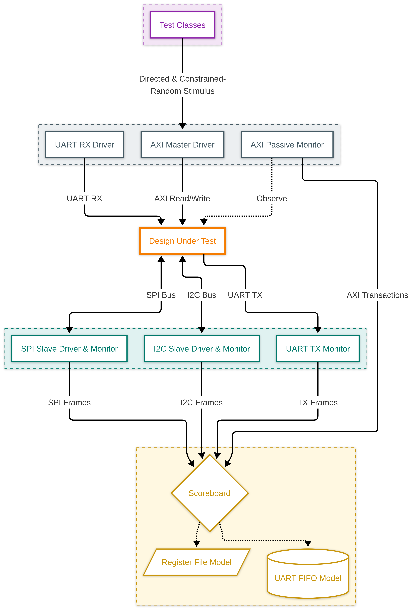

# AXI4-Lite Peripheral Subsystem Verification Plan (vPlan)

This document defines the verification strategy, testbench architecture, functional coverage targets, and sign-off criteria for the AXI4-Lite Peripheral Subsystem. 

---

## 1. Environment Architecture

The verification environment is a transaction-level, layered SystemVerilog testbench. It uses virtual interfaces for physical DUT coupling and mailboxes for transaction communication. 

The scope of verification is focused on proving the correct behavior of the AXI4-Lite slave interface, the register decoder, internal register files, the skid buffers, the synchronous UART transmit FIFO, and the integration wrappers for the peripheral cores. Core-internal verification of the SPI, I2C, and UART masters is out of scope for this subsystem plan, which targets integration: register mapping, wrapper behavior, and the AXI boundary. The testbench exercises their serial interface pins only to the extent required to validate that mapping.

**Components:**
*   **Transaction Descriptor** and **Constrained-Random Generator**.
*   **AXI Master Driver**: sources all five AXI4-Lite channels, with independent control of the AW and W channel timing.
*   **SPI Slave Responder / Monitor**: sources `SPI_MISO` and reconstructs frames.
*   **I2C Slave Responder / Monitor**: drives `I2C_SDA` only with data and ACK/NACK; monitors `I2C_SCL` passively.
*   **Active UART RX Driver**: drives the DUT's `UART_RX` input as a remote transmitter to exercise the receive path.
*   **UART TX Monitor**: passively captures the `UART_TX` output.
*   **Register / FIFO Reference Models**, **AXI Passive Monitor**, **Scoreboard**, and **Coverage Collector**.

---

## 2. Reference Models

The testbench implements the following reference models:
*   **Register File Reference Model**: predicts the bus-deterministic behavior of the register map — self-clearing bits, read-on-clear actions, write-strobe masking, write-to-read-only protection, and decode responses. It deliberately does **not** predict core-timed status bits (transfer `BUSY`, the *setting* of `RX_VALID`, `NACK`, `RX_PERR`), which depend on serial-core timing and are validated by the Status Forwarding check (§4), not modeled here.
*   **UART Transmit FIFO Model**: tracks the exact occupancy, registered empty/full flags, the full/empty boundary bypass rules, and the registered pop latency of the UART transmit FIFO.
*   **Peripheral Slave Models**: behavioral SPI slave (reused from the companion SPI Master verification project) and I2C slave (with ACK/NACK injection). The UART receive path is exercised by the active RX driver (§1) and the transmit path captured by the TX monitor (§3).

---

## 3. Passive Monitors

Monitors operate passively to capture interface transactions and forward them to the scoreboard:
*   **AXI Passive Monitor**: Observes all five AXI4-Lite channels (`AW`, `W`, `B`, `AR`, `R`) to reconstruct bus transactions.
*   **SPI Bus Monitor**: Monitors `SPI_SCLK`, `SPI_MOSI`, `SPI_MISO`, and `SPI_CSN` to reconstruct transmitted/received SPI frames.
*   **I2C Bus Monitor**: Observes `I2C_SCL` and `I2C_SDA` lines to reconstruct address, direction, data, and ACK/NACK status.
*   **UART TX Monitor**: Captures serial transmissions on the `UART_TX` pin to reconstruct outgoing data bytes.

---

## 4. Scoreboard Checks

The scoreboard performs self-checking comparisons for every completed transaction:
1.  **Read Data & Response Check**: Compares the `RDATA` and `RRESP` returned from read transactions against the register reference model.
2.  **Write Commit & Response Check**: Verifies register state changes against the reference model after write-strobe masking, and confirms write-to-read-only rejection (`SLVERR`) and address decode errors (`DECERR`).
3.  **Status Forwarding & Envelope Check**: Confirms that core-driven status fields read back equal the corresponding core status outputs (white-box), and that sticky flags (`NACK`, `RX_OVERRUN`) hold until their defined clear event.
4.  **SPI Round-Trip Check**: Confirms the byte written to `SPI_TXDATA` appears on `SPI_MOSI` under the configured mode, that the byte returned on `SPI_MISO` lands in `SPI_RXDATA`, and that `RX_VALID` sets on completion and clears on read.
5.  **I2C Round-Trip Check**: Confirms the address, direction, and data observed on the bus match `I2C_ADDR` / `I2C_CTRL.RW_N` / `I2C_TXDATA`, that a NACK from the slave sets the `NACK` flag, and that a returned byte lands in `I2C_RXDATA`.
6.  **End-to-End UART TX Path Check**: Compares the stream of bytes observed by the UART TX monitor against the reference FIFO, verifying correct transmit order, that a write while the FIFO is full is dropped unless a concurrent pop accepts it, and that the decoded parity bit and stop-bit count match `UART_CFG`.
7.  **UART RX Round-Trip Check**: Confirms a byte driven by the RX driver lands in `UART_RXDATA` with `RX_VALID` set, that a second byte arriving before the first is read sets `RX_OVERRUN`, and that `RX_PERR` sets only on frames with incorrect parity, exercised across the supported parity and stop-bit formats.

---

## 5. SVA Inventory

All assertions are implemented in a separate bind file and instantiated directly in `tb_top`.

**Note on slave-side scope:** the AW/W/AR channel rules (B1–B4 as applied to master-driven signals) are properties of the stimulus, so they double as legality checks on the AXI Master Driver; the B/R channel rules and all register/microarchitecture assertions are obligations of the DUT itself.

### Boundary Protocol Assertions
*   **B1 [assert]** A channel's `VALID` signal remains asserted high until its corresponding `READY` is asserted (handshake completes).
*   **B2 [assert]** Payloads remain stable while `VALID` is high and `READY` is low, applied per signal. (AW: `AWADDR`,`AWPROT`; W: `WDATA`,`WSTRB`; B: `BRESP`; AR: `ARADDR`,`ARPROT`; R: `RDATA`,`RRESP`.)
*   **B3 [assert]** While `ARESETn` is asserted, all five channel `VALID` outputs are driven low, and no `VALID` rises before the first cycle after reset deassertion.
*   **B4 [assert]** No signal on an active AXI4-Lite channel contains unknown values (X/Z) while its `VALID` is high.
*   **B5 [assert]** `BRESP` and `RRESP` are never driven to `2'b01`. *(AXI4-Lite specialization: EXOKAY is legal in full AXI but unused here, as there is no exclusive access.)*
*   **B6 [assert]** The write outstanding-transaction count is bounded to `[0, 1]`.
*   **B7 [assert]** The read outstanding-transaction count is bounded to `[0, 1]`.
*   **B8 [assert]** Write-response latency is bounded: `BVALID` asserts within a fixed number of cycles (target 3) of the **later** of the AW and W boundary handshakes.
*   **B9 [assert]** Read-response latency is bounded: `RVALID` asserts within a fixed number of cycles (target 3) of the AR boundary handshake.

### White-Box Design Assertions
*   **W1 [assert]** The input skid buffers do not accept new upstream data when in the `FULL` state. *(Sim-unreachable given the current driver; waived — see §9.)*
*   **W2 [assert]** The skid buffers' `in_ready` and `out_valid` are register-driven, with no combinational path from the downstream ready input to `in_ready`. *(`in_ready` side sim-unreachable given the current driver; waived — see §9.)*
*   **W3 [assert]** The UART transmit FIFO's pointer-derived occupancy remains within `[0, 64]`.
*   **W4 [assert]** The FIFO flags map correctly to occupancy (empty ⇔ occupancy == 0, full ⇔ occupancy == 64).
*   **W5 [assert]** The FIFO does not overflow, except a write is accepted while full if a pop occurs the same cycle, leaving occupancy unchanged. *(Sim-unreachable; waived — see §9.)*
*   **W6 [assert]** The FIFO does not underflow, except a pop is accepted while empty if a push occurs the same cycle, forwarding the pushed byte directly. *(Sim-unreachable; waived — see §9.)*
*   **W7 [assert]** The FIFO drains into the core only when `UART_CTRL[0]` (`TX_EN`) is enabled.
*   **W8 [assert]** The FIFO's read output changes only on an accepted pop.
*   **W9 [assert]** Exactly one of the address decoder's page-select outputs (or its decode-error output) is asserted for any address — no overlapping or aliased page decode.
*   **W10 [assert]** The decode-error output asserts if and only if the address falls outside the three defined pages.
*   **W11 [assert]** Read-on-clear status flags (such as `RX_VALID`) clear on the read-commit strobe (`rd_commit`) that accepts the read address, not on `RVALID` assertion.

### Stimulus Constraints
*   **C1 [constraint]** Addresses are biased to hit defined registers and to hit undecoded regions in both mapped and unmapped pages.
*   **C2 [constraint]** `WSTRB` is randomized across its full legal range, biased toward the must-hit patterns (all-zeros, each single lane, all-ones, and multi-lane partials). *(All `WSTRB` values are legal in AXI4-Lite; this is a stimulus bias, not a legality restriction.)*
*   **C3 [constraint]** `BREADY` and `RREADY` are randomized with wait states but must eventually assert, preventing deadlock.
*   **C4 [constraint]** `UART_TXDATA` writes are generated in bursts (up to 65+ bytes) to exercise FIFO occupancy limits.
*   **C5 [constraint]** AW and W handshakes are driven with independently randomized timing, producing address-first, data-first, and concurrent arrival.
*   **C6 [constraint]** Inter-transaction spacing is randomized across back-to-back and gapped presentation.
*   **C7 [constraint]** The active UART RX driver generates frames across the supported parity (none/even/odd) and stop-bit (1/2) formats, including parity-error injection, with `UART_CFG` set to match — or mismatch, for injected errors — the driven format.

---

## 6. Functional Coverage Plan

### Coverpoints
*   **Transaction Type**: Reads and writes on the AXI bus.
*   **Register Hit Map**: Accesses (read and write) to each register offset across the SPI, I2C, and UART pages.
*   **Write Strobes (`WSTRB`)**: Single-byte lanes (`0x1`, `0x2`, `0x4`, `0x8`), all-zeros (`0x0`), all-ones (`0xF`), and multi-lane patterns.
*   **Write Channel Arrival Order**: Address-first, data-first, and concurrent arrival.
*   **Access Spacing**: Back-to-back and gapped transactions.
*   **Response Types**: `OKAY`, `SLVERR`, and `DECERR` on both read and write channels.
*   **UART Transmit FIFO Occupancy**: Bins for empty (`0`), full (`64`), and intermediate (`1-63`).
*   **UART Transmit FIFO Events**: Push, pop, and write-while-full drop events, and full-to-empty drain transitions. (Simultaneous push/pop waived — see §9.)
*   **UART Frame Format**: Parity (`none`, `even`, `odd`) × stop bits (`1`, `2`).
*   **SPI CPOL**: Clock idle level, both polarities.
*   **SPI CPHA**: Clock phase, both settings.
*   **SPI Transfer Data**: All-zeros, all-ones, alternating (`0x55`/`0xAA`), and other byte values on `MOSI` and `MISO`.
*   **I2C Direction (`RW_N`)**: Read and write transactions.
*   **I2C ACK/NACK Response**: Both ACK and NACK from the slave.
*   **I2C Transfer Data**: All-zeros, all-ones, alternating (`0x55`/`0xAA`), and other byte values on `TXDATA`/`RXDATA`.
*   **UART RX Status Events**: `RX_VALID` on valid receipt, `RX_OVERRUN` on a second byte before read, `RX_PERR` on injected parity errors.

### Required Crosses
*   `Register` × `Transaction Type` — reads and writes to every register.
*   `Register` × `WSTRB` — every writable register written with each must-hit WSTRB pattern.
*   `Write Channel Arrival Order` × `Response Types` — all three entry paths reach a valid response.
*   `Access Spacing` × `Transaction Type`.
*   `SPI CPOL` × `SPI CPHA` — all four SPI modes exercised.
*   `SPI CPHA` × `SPI Transfer Data` — each interesting data pattern seen in both CPHA settings, on both `MOSI` and `MISO`.
*   `I2C Direction` × `I2C ACK/NACK Response` — both directions see both ACK and NACK.

### Closure Target
The following must-hit set is required at 100%; overall functional coverage must reach ≥ 95%, with written waivers for intentionally unreachable bins.
*   All register × type bins.
*   All response-type bins on both channels. (SLVERR is write-only; impossible on reads.)
*   All WSTRB must-hit patterns.
*   All three write-channel arrival-order paths.
*   All four SPI modes.
*   All four interesting SPI data patterns (`0x00`/`0xFF`/`0x55`/`0xAA`) observed on both `MOSI` and `MISO`.
*   Both I2C directions (`read`/`write`) see both ACK and NACK.
*   All four interesting I2C data patterns observed on `TXDATA`/`RXDATA`.
*   SPI and UART RX round-trips exercised.
*   At least one FIFO full-to-empty drain and write-while-full drop. (Simultaneous push/pop waived — see §9.)
*   All three parity modes and both stop-bit settings exercised, and at least one RX parity-error detection.
*   At least one `RX_OVERRUN` event.

---

## 7. Constrained-Random Strategy

Transactions are randomized across address ranges, write data, write strobes, arrival order, and access spacing per constraints C1–C6. Generator biases emphasize:
*   Back-to-back `UART_TXDATA` bursts to force FIFO saturation and backpressure (C4).
*   Independently timed AW/W handshakes to exercise all write-FSM entry states (C5).
*   Randomized ready/valid wait states on both directions to stress handshake robustness (C3).
*   Interleaved accesses across peripheral pages to exercise address decoding.

---

## 8. Test Case Inventory

*   **`test_register_access`**: Directed read/write to every register address, covering write-strobe alignment, read-only protection, and decode errors.
*   **`test_arrival_order`**: Directed staggered AW/W traffic (address-first, data-first, concurrent) to exercise the `W_WAIT_DATA` and `W_WAIT_ADDR` states explicitly.
*   **`test_peripheral_roundtrip`**: Directed serial round-trips — SPI across all four modes, I2C write and read with both ACK and NACK, and UART transmit and receive sweeping parity (none/even/odd) and stop bits (1/2), including parity-error injection (`RX_PERR`) — validating the wrapper mapping end to end.
*   **`test_fifo_stress`**: Back-to-back `UART_TXDATA` bursts to fill the FIFO, verify `TX_READY` backpressure, exercise the write-while-full drop and bypass policy, and confirm the subsequent drain.
*   **`test_random_regression`**: 5,000 randomized AXI transactions across all channels and pages, with randomized delays and configurations. The peripheral round-trips these accesses trigger are scored alongside the bus traffic.

---

## 9. Waivers

This section documents coverage and assertion gaps that are structurally unreachable by the current testbench architecture (not merely rare). Every waived item has been proven exhaustively by formal verification.

| ID | Coverage Gap | Unreachable Reason | Disposition |
|---|---|---|---|
| **WAIVER - 01** | Skid buffer `FULL` state (Properties: `W1`, `W2`, `B1`, `B2`) | The `axi_driver` is single-outstanding. It never issues a new transaction while a prior transaction holds `READY` low, preventing the `FULL` state. | Waived from simulation closure. Proven exhaustively by formal verification in `skid_buffer.sv`. |
| **WAIVER - 02** | UART FIFO concurrent push/pop (Properties: `W5`, `W6`) | Requires a same-cycle push and pop exactly at the full/empty boundary. AXI-driven stimulus cannot reliably produce this timing. | Waived from simulation closure. Proven exhaustively by formal verification. |

---

## 10. Sign-off / Exit Criteria

Verification is complete and ready for release when:
*   **Functional Coverage**: 100% of the must-hit coverpoints and crosses (§6) are reached or covered by approved waivers (§9), and overall functional coverage is ≥ 95%.
*   **Zero Mismatch Errors**: The scoreboard reports zero data mismatches across register and serial checks.
*   **Zero Protocol Violations**: No AXI or interface SVA failures across the regression.
*   **Formal Proofs**: All safety and liveness properties of the skid buffer and the synchronous UART transmit FIFO are proven via formal analysis (§5 SVA Inventory).
*   **Regression Status**: The regression suite compiles and completes cleanly without warnings.
*   **Bug-Hunt Log**: Populated, with each entry root-caused and resolved (§11).

---

## 11. Bug-Hunt Log

This log is a living artifact, populated during bring-up and regression. Each entry records a defect first caught by constrained-random regression that directed tests missed, so the commit history corroborates the verification effort.

| ID & Type | Observed Symptom | Root Cause & Resolution | Affected File |
|---|---|---|---|
| **RTL - 01** | `I2C_STATUS.nack` read back as `1` after a successful transaction. | `nack_reg` was gated on the combinational `i2c_nack` level, which is high through `IDLE`/`START` and always shadowed the `i2c_start` clear. Fixed by latching `nack_reg` from the master's `valid` completion pulse instead. | [i2c_regs.sv](../rtl/i2c/i2c_regs.sv#L155) |
| **RTL - 02** | Deasserting `rx_en` had no effect on UART reception. | The RX FSM and baud/oversample generator ran unconditionally, never consulting `rx_en`. Fixed by gating `next_state` and `enable` on `rx_en`. | [uart_rx.sv](../rtl/uart/uart_rx.sv#L120) |
| **RTL - 03** | `cs_n` glitches low pre-reset, ahead of any real transfer. | `cs_n` defaulted low, relying on the `IDLE` arm to deassert it; the undefined pre-reset state matched no arm. Fixed by defaulting `cs_n` high instead. | [spi_master.sv](../rtl/spi/spi_master.sv#L180) |
| **RTL - 04** | UART RX froze (or ran at a degenerate rate) after `UART_CFG`'s divider changed live. | `baud_gen` compared the counter to the divisor with equality, missing it forever if the divisor shrank; a divisor of `0` also underflowed the target. Fixed with `>=` and a zero-divisor clamp. | [baud_gen.sv](../rtl/uart/baud_gen.sv#L32) |
| **RTL - 05** | UART bytes were garbled if `UART_CFG` changed mid-transfer. | `uart_rx`/`uart_tx` read baud/parity/stop-bit config live instead of latching it at transfer start. Fixed by capturing config once on start, matching `spi_master`/`i2c_master`. | [uart_rx.sv](../rtl/uart/uart_rx.sv#L129) / [uart_tx.sv](../rtl/uart/uart_tx.sv#L123) |

---
